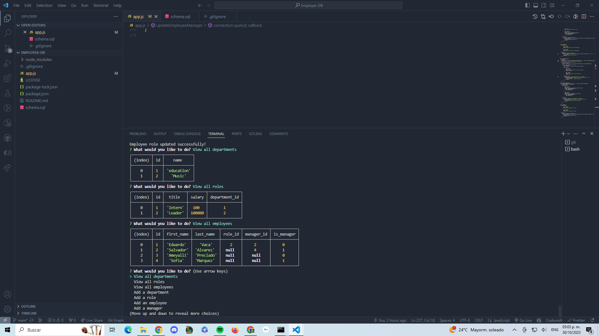

# Employer-DB

](https://opensource.org/licenses/MIT)

## Description

A command-line application for managing employee data within a company. Users can add, update, view, and delete employee information, roles, and departments.

## Features

-Employee Management: Add, view, update, and delete employees.
-Role Management: Define and manage roles within the organization.
-Department Management: Create and oversee various departments.
-Database Integration: Utilizes MySQL for data storage and retrieval.

## Prerequisites
Node.js
MySQL

## Usage

1. Run the Application:
   node app.js

2. Follow the On-Screen Instructions: Navigate through the provided options to manage employee data.

3. Database Interaction: The application communicates with the employeedb database for all operations.

## Installation

1. Clone the Repository:
   git clone [https://github.com/Nagaft/Employer-DB]

2. Navigate to the Project Folder:
   cd Employer-DB

3. Install Dependencies:
npm install

## Contributing

We welcome contributions. Please feel free to submit a pull request or open an issue on GitHub.

## Testing

To run unit tests:
  npm test

## License

This project is licensed under the MIT License.

## Contact

- GitHub: [https://github.com/your-username/your-repo](https://github.com/Nagaft/Note-Web)
- Email: nagaf999@gmail.com